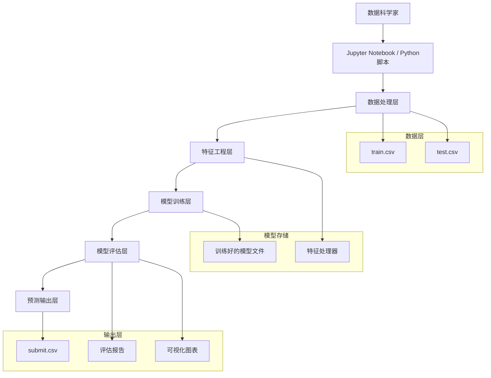

# 环状RNA组织表达预测 - 技术架构文档

## 1. 架构设计

## 2. 技术描述

* **开发环境**: Python 3.8+ + Jupyter Notebook

* **核心库**: pandas, numpy, scikit-learn, xgboost, lightgbm

* **数据可视化**: matplotlib, seaborn, plotly

* **模型评估**: sklearn.metrics, classification\_report

* **数据处理**: pandas, numpy

## 3. 路由定义

本项目为数据科学项目，主要通过Jupyter Notebook进行交互式开发，主要的工作流程包括：

| 阶段                    | 目的         |
| --------------------- | ---------- |
| /data\_exploration    | 数据探索和可视化分析 |
| /feature\_engineering | 特征工程和数据预处理 |
| /model\_training      | 模型训练和超参数优化 |
| /model                |       |

