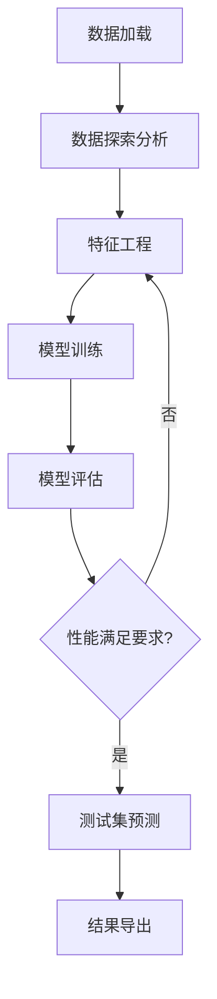

# 环状RNA组织表达预测挑战赛 - 产品需求文档

## 1. 产品概述

本项目旨在开发一个基于机器学习的环状RNA（circRNA）组织表达预测系统，通过分析环状RNA的多维特征来预测其在不同组织中的表达情况。该系统将帮助生物信息学研究人员更好地理解circRNA的调控机制和生物学功能。

环状RNA作为一类重要的非编码RNA，在组织发育、疾病发生和生物调控中发挥关键作用。本系统通过机器学习技术，基于序列特征、结构特征和生物化学特征，实现对circRNA在7种不同组织类型中表达模式的准确预测。

项目目标是构建一个高精度的多分类预测模型，在Macro-F1评估指标上达到优异性能，为circRNA功能研究提供有力的计算工具支持。

## 2. 核心功能

### 2.1 用户角色

| 角色 | 注册方式 | 核心权限 |
|------|----------|----------|
| 数据科学家 | 项目团队成员 | 可进行数据探索、模型开发、特征工程和模型评估 |
| 生物信息学研究员 | 合作研究者 | 可查看预测结果、分析报告和模型解释 |
| 系统管理员 | 系统分配 | 可管理数据、监控模型性能和系统维护 |

### 2.2 功能模块

本环状RNA组织表达预测系统包含以下主要页面：
1. **数据探索分析页面**：数据统计概览、特征分布可视化、相关性分析
2. **特征工程页面**：特征选择、特征变换、新特征构建
3. **模型训练页面**：算法选择、超参数调优、模型训练监控
4. **模型评估页面**：性能指标展示、混淆矩阵、特征重要性分析
5. **预测结果页面**：测试集预测、结果可视化、结果导出

### 2.3 页面详情

| 页面名称 | 模块名称 | 功能描述 |
|----------|----------|----------|
| 数据探索分析页面 | 数据概览模块 | 展示训练数据基本统计信息，包括样本数量、特征分布、缺失值统计 |
| 数据探索分析页面 | 特征可视化模块 | 生成各特征的分布图、箱线图、散点图，分析特征与目标变量的关系 |
| 数据探索分析页面 | 相关性分析模块 | 计算特征间相关系数，生成相关性热力图，识别冗余特征 |
| 特征工程页面 | 特征选择模块 | 基于统计方法和机器学习算法进行特征筛选，移除低重要性特征 |
| 特征工程页面 | 特征变换模块 | 对数值特征进行标准化、归一化处理，对分类特征进行编码 |
| 特征工程页面 | 特征构建模块 | 基于领域知识创建新特征，如碱基比例组合、能量密度等衍生特征 |
| 模型训练页面 | 算法选择模块 | 提供多种机器学习算法选择，包括随机森林、XGBoost、LightGBM等 |
| 模型训练页面 | 超参数优化模块 | 使用网格搜索、贝叶斯优化等方法进行超参数调优 |
| 模型训练页面 | 训练监控模块 | 实时显示训练进度、损失函数变化、验证集性能指标 |
| 模型评估页面 | 性能指标模块 | 展示Macro-F1、精确率、召回率、准确率等多项评估指标 |
| 模型评估页面 | 混淆矩阵模块 | 生成7分类混淆矩阵，分析各类别预测准确性和错误模式 |
| 模型评估页面 | 特征重要性模块 | 分析各特征对预测结果的贡献度，提供模型可解释性 |
| 预测结果页面 | 测试预测模块 | 对测试集进行预测，生成符合比赛要求的submit.csv文件 |
| 预测结果页面 | 结果可视化模块 | 展示预测结果分布、置信度分析、预测概率分布 |
| 预测结果页面 | 结果导出模块 | 导出预测结果文件，支持多种格式，便于提交和后续分析 |

## 3. 核心流程

### 主要操作流程

**数据科学家工作流程：**
1. 登录系统 → 数据探索分析页面
2. 查看数据概览和特征分布 → 特征工程页面
3. 进行特征选择和变换 → 模型训练页面
4. 选择算法并训练模型 → 模型评估页面
5. 分析模型性能 → 预测结果页面
6. 生成最终预测结果

**系统处理流程图：**

## 4. 用户界面设计

### 4.1 设计风格

- **主色调**：深蓝色 (#1f4e79) 和浅蓝色 (#4a90e2)，体现科学研究的专业性
- **辅助色**：绿色 (#28a745) 表示成功状态，橙色 (#fd7e14) 表示警告，红色 (#dc3545) 表示错误
- **按钮风格**：圆角矩形按钮，具有轻微阴影效果
- **字体**：主要使用 'Segoe UI', 'Microsoft YaHei', sans-serif，字号14px-18px
- **布局风格**：卡片式布局，清晰的模块分割，响应式设计
- **图标风格**：使用简洁的线性图标，与科学数据分析主题保持一致

### 4.2 页面设计概览

| 页面名称 | 模块名称 | UI元素 |
|----------|----------|--------|
| 数据探索分析页面 | 数据概览模块 | 统计卡片、数据表格、进度条显示数据完整性 |
| 数据探索分析页面 | 特征可视化模块 | 交互式图表（柱状图、散点图、箱线图），图表工具栏，颜色编码 |
| 特征工程页面 | 特征选择模块 | 特征列表、重要性评分条、选择复选框、批量操作按钮 |
| 模型训练页面 | 算法选择模块 | 算法卡片选择器、参数配置面板、训练按钮、进度指示器 |
| 模型评估页面 | 性能指标模块 | 指标仪表盘、对比图表、性能趋势线、颜色编码的评分等级 |
| 预测结果页面 | 结果导出模块 | 下载按钮、文件格式选择器、预览表格、导出进度条 |

### 4.3 响应式设计

系统采用桌面优先的响应式设计，主要针对数据科学家的工作环境进行优化。在大屏幕上提供丰富的数据可视化和多面板布局，在中等屏幕上保持核心功能的可用性。考虑到数据分析的复杂性，不特别优化移动端体验，但确保基本功能在平板设备上可用。